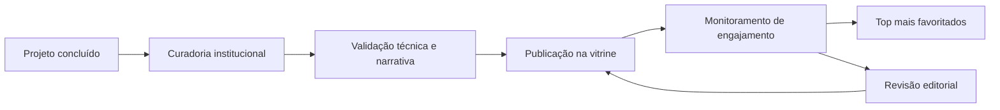

<!-- Este conteúdo é espelhado em README.md para manter o perfil da organização alinhado com o repositório .github. -->

  

<h1 align="center">Projetos em Destaque • Instituto Mauá de Tecnologia</h1>

  Uma vitrine institucional dos projetos desenvolvidos por alunos do IMT que traduzem formação prática, inovação aplicada e impacto no mundo real.

  <em>Na Mauá, aprender é experimentar.</em>

  
  
  

  
  
  
  

---

## Uma vitrine do que se constrói na Mauá

Esta página reúne projetos selecionados para representar a produção estudantil do Instituto Mauá de Tecnologia no GitHub. Aqui ganham destaque soluções já concluídas, bem estruturadas e prontas para comunicar o nível técnico, a criatividade e a capacidade de execução desenvolvidos ao longo da formação no IMT.

Com base no posicionamento institucional da Mauá, esta vitrine valoriza projetos conectados a desafios reais, protagonismo estudantil, pesquisa aplicada, inovação e reconhecimento acadêmico.

<table>
  <tr>
    <td width="33%" valign="top">
      <h3>Projetos prontos</h3>
      
Casos concluídos, com documentação clara, narrativa consistente e potencial de demonstração pública.

    </td>
    <td width="33%" valign="top">
      <h3>Impacto aplicado</h3>
      
Soluções alinhadas a problemas de mercado, sociedade, indústria, pesquisa e transformação digital.

    </td>
    <td width="33%" valign="top">
      <h3>Excelência visível</h3>
      
Uma seleção que ajuda a mostrar a força da formação Mauá em engenharia, tecnologia, negócios e design.

    </td>
  </tr>
</table>

---

## Áreas em destaque

  
  
  
  
  
  

---

## Como a vitrine evolui

  
  
  

---

## Top mais favoritados

<!-- top-favoritados:start -->
<!-- Maintainers: a automação considera os repositórios públicos marcados com a topic "imt-showcase". -->
<table>
  <tr>
    <td width="33%" align="center" valign="top">
      
      <h3>Em atualização</h3>
      
Este espaço será preenchido automaticamente assim que um novo destaque da vitrine for publicado.

      
<code>⭐ stars</code> <code>🔁 forks</code> <code>🕒 sincronizando</code>

    </td>
    <td width="33%" align="center" valign="top">
      
      <h3>Em atualização</h3>
      
Este espaço será preenchido automaticamente assim que um novo destaque da vitrine for publicado.

      
<code>⭐ stars</code> <code>🔁 forks</code> <code>🕒 sincronizando</code>

    </td>
    <td width="33%" align="center" valign="top">
      
      <h3>Em atualização</h3>
      
Este espaço será preenchido automaticamente assim que um novo destaque da vitrine for publicado.

      
<code>⭐ stars</code> <code>🔁 forks</code> <code>🕒 sincronizando</code>

    </td>
  </tr>
</table>

<!-- top-favoritados:end -->

---

## O que cada projeto deve comunicar

- contexto e problema que a solução resolve;
- stack, arquitetura e tecnologias principais;
- evidências de execução, protótipo, demo ou resultado final;
- clareza de documentação para leitura rápida e compartilhamento;
- potencial de aplicação, inovação e impacto.

---

## Conexão com o IMT

Na Mauá, os projetos práticos fazem parte da rotina acadêmica e colocam os alunos diante de desafios conectados às demandas do mercado e da sociedade. A vitrine desta organização traduz esse espírito em repositórios que reforçam a cultura de experimentação, colaboração, protagonismo e excelência que marca o IMT.

  
  

  <strong>Instituto Mauá de Tecnologia</strong> 
  Formação prática, inovação aplicada e projetos com impacto real.

